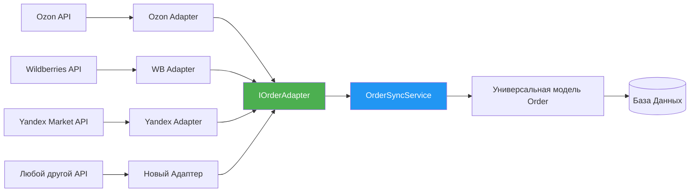

# 🧭 Общая идея и принципы

Основная идея максимально простая и мощная:
> Одна универсальная модель Заказа для всей системы. Каждый маркетплейс имеет свой отдельный изолированный адаптер, который знает только как перевести странный JSON маркетплейса в твою нормальную модель.

Вся остальная система **вообще не знает** что существуют разные маркетплейсы. Она работает только с одним интерфейсом и одной моделью.

✅ Преимущества:
- Добавление нового маркетплейса = написание одного нового класса
- Ноль изменений в существующем коде
- Ошибка в одном маркетплейсе не ломает всю систему
- Единая логика сохранения, обновления, валидации для всех
- Легко тестировать и отлаживать каждый адаптер отдельно

---

# 🗺️ Финальная схема архитектуры

Улучшенная и дополненная версия твоей схемы:



---

# 💻 Пошаговая реализация с кодом

---

## Шаг 1: Контракт интерфейса

Самый важный файл во всей системе. Единый контракт который абсолютно все адаптеры обязаны реализовать.

```csharp
public interface IOrderAdapter
{
    // Уникальное имя маркетплейса
    string MarketplaceName { get; }

    // Получить заказы за период
    Task<List<Order>> GetOrdersAsync(DateTime from, DateTime to);

    // Получить один конкретный заказ
    Task<Order> GetOrderAsync(string externalOrderId);
}
```

---

## Шаг 2: Универсальная модель Заказа

Это святыня. Никогда и ни при каких обстоятельствах не подстраивай эту модель под маркетплейсы. Все адаптеры подстраиваются под неё.

```csharp
// Единая модель для всей системы, одинаковая для всех маркетплейсов
public class Order
{
    // Внешний номер заказа у маркетплейса
    public string ExternalId { get; set; }
    
    // Из какого маркетплейса пришёл заказ
    public string Marketplace { get; set; }

    // Общие поля одинаковые для всех
    public DateTime CreatedAt { get; set; }
    public OrderStatus Status { get; set; }
    public decimal TotalSum { get; set; }
    public string ClientName { get; set; }
    public string Phone { get; set; }
    public string Address { get; set; }

    public List<OrderItem> Items { get; set; } = new();
}

public enum OrderStatus
{
    New,
    Paid,
    Assembly,
    Shipped,
    Delivered,
    Cancelled
}

public class OrderItem
{
    public string Sku { get; set; }
    public string Name { get; set; }
    public int Quantity { get; set; }
    public decimal Price { get; set; }
}
```

---

## Шаг 3: Адаптер для конкретного маркетплейса

Весь весь весь код специфичный для маркетплейса находится ТОЛЬКО здесь. Нигде больше в системе нет ни одной строчки кода про Ozon/Wildberries.

```csharp
public class OzonOrderAdapter : IOrderAdapter
{
    private readonly OzonApiClient _api;

    public OzonOrderAdapter(OzonApiClient api)
    {
        _api = api;
    }

    public string MarketplaceName => "Ozon";

    public async Task<List<Order>> GetOrdersAsync(DateTime from, DateTime to)
    {
        // Адаптер может делать сколько угодно запросов к API
        // Для остальной системы это абсолютно чёрный ящик
        var ozonOrders = await _api.GetPostingsAsync(from, to);

        return ozonOrders.Select(MapOzonOrder).ToList();
    }

    // Вся ужасная специфичная логика парсинга и конвертации только здесь
    private Order MapOzonOrder(OzonPosting ozonOrder)
    {
        return new Order
        {
            ExternalId = ozonOrder.PostingNumber,
            Marketplace = MarketplaceName,
            CreatedAt = ozonOrder.CreatedAt.UtcDateTime,
            Status = MapStatus(ozonOrder.Status),
            TotalSum = ozonOrder.Prices.Total,
            ClientName = ozonOrder.Customer.FullName,
            Phone = ozonOrder.Customer.Phone,

            Items = ozonOrder.Products.Select(p => new OrderItem
            {
                Sku = p.OfferId,
                Name = p.Name,
                Quantity = p.Quantity,
                Price = p.Price
            }).ToList()
        };
    }

    private OrderStatus MapStatus(string ozonStatus)
    {
        return ozonStatus switch
        {
            "delivering" => OrderStatus.Shipped,
            "delivered" => OrderStatus.Delivered,
            "cancelled" => OrderStatus.Cancelled,
            _ => OrderStatus.New
        };
    }

    public Task<Order> GetOrderAsync(string externalOrderId)
    {
        // реализация
    }
}
```

> ❗ Важное правило: Никогда не используй AutoMapper здесь. В 99% случаев это не просто маппинг полей, это бизнес логика конвертации. AutoMapper будет только прятать ошибки.

---

## Шаг 4: Единый сервис синхронизации и сохранения

Самая вкусная часть. Этот сервис вообще ничего не знает про существование разных маркетплейсов. Он работает только с интерфейсом `IOrderAdapter`.

Одна и та же логика сохранения, обновления, транзакций и обработки ошибок для абсолютно всех маркетплейсов.

```csharp
public class OrderSyncService
{
    private readonly AppDbContext _db;
    private readonly ILogger<OrderSyncService> _logger;

    public OrderSyncService(AppDbContext db, ILogger<OrderSyncService> logger)
    {
        _db = db;
        _logger = logger;
    }

    public async Task SyncOrdersAsync(IOrderAdapter adapter, DateTime from, DateTime to)
    {
        _logger.LogInformation("Начинаю синхронизацию {Marketplace}", adapter.MarketplaceName);

        try
        {
            var orders = await adapter.GetOrdersAsync(from, to);
            _logger.LogInformation("Получено {Count} заказов", orders.Count);

            foreach (var order in orders)
            {
                // ✅ Отдельная транзакция на каждый заказ
                // Либо весь заказ сохранился целиком, либо вообще ничего не изменилось
                using var transaction = await _db.Database.BeginTransactionAsync();

                try
                {
                    await UpsertOrderAsync(order);
                    await _db.SaveChangesAsync();
                    await transaction.CommitAsync();
                }
                catch (Exception ex)
                {
                    await transaction.RollbackAsync();
                    _logger.LogError(ex, "Ошибка сохранения заказа {Id}", order.ExternalId);
                    
                    // ❗ Ошибка одного заказа не ломает всю синхронизацию
                    continue;
                }
            }

            _logger.LogInformation("Синхронизация {Marketplace} завершена", adapter.MarketplaceName);
        }
        catch (Exception ex)
        {
            _logger.LogCritical(ex, "Критическая ошибка синхронизации {Marketplace}", adapter.MarketplaceName);
        }
    }

    // Универсальный метод: обновить если существует, создать если нет
    private async Task UpsertOrderAsync(Order order)
    {
        var existing = await _db.Orders
            .Include(o => o.Items)
            .FirstOrDefaultAsync(o => 
                o.Marketplace == order.Marketplace 
                && o.ExternalId == order.ExternalId);

        if (existing == null)
        {
            _db.Add(order);
        }
        else
        {
            // Обновляем все поля существующего заказа
            _db.Entry(existing).CurrentValues.SetValues(order);

            // Полностью заменяем позиции заказа
            _db.OrderItems.RemoveRange(existing.Items);
            existing.Items = order.Items;
        }
    }
}
```

---

## Шаг 5: Фабрика адаптеров

```csharp
public class OrderAdapterFactory
{
    private readonly IServiceProvider _sp;

    public OrderAdapterFactory(IServiceProvider sp) => _sp = sp;

    public IOrderAdapter GetAdapter(string marketplace)
    {
        return marketplace.ToLower() switch
        {
            "ozon" => _sp.GetRequiredService<OzonOrderAdapter>(),
            "wildberries" => _sp.GetRequiredService<WildberriesOrderAdapter>(),
            "yandexmarket" => _sp.GetRequiredService<YandexOrderAdapter>(),
            _ => throw new NotSupportedException($"Маркетплейс {marketplace} не поддерживается")
        };
    }
}
```

---

## Шаг 6: Регистрация и использование

```csharp
// Регистрация в DI
builder.Services.AddScoped<OzonOrderAdapter>();
builder.Services.AddScoped<WildberriesOrderAdapter>();
builder.Services.AddScoped<YandexOrderAdapter>();

builder.Services.AddScoped<OrderAdapterFactory>();
builder.Services.AddScoped<OrderSyncService>();
```

Пример использования:

```csharp
// Синхронизировать Ozon за последние 24 часа
var adapter = factory.GetAdapter("ozon");
await syncService.SyncOrdersAsync(adapter, DateTime.UtcNow.AddDays(-1), DateTime.UtcNow);

// Синхронизировать Wildberries за последние 1 час
var adapter2 = factory.GetAdapter("wildberries");
await syncService.SyncOrdersAsync(adapter2, DateTime.UtcNow.AddHours(-1), DateTime.UtcNow);
```

Запуск по расписанию через Hangfire:

```csharp
RecurringJob.AddOrUpdate("sync-wb", 
    () => syncService.SyncOrdersAsync(factory.GetAdapter("wildberries"), DateTime.UtcNow.AddHours(-1), DateTime.UtcNow),
    Cron.Every15Minutes);
```

---

# 🎯 Золотые правила которые нельзя нарушать

1. ❌ Никогда не добавляй в универсальную модель `Order` поля которые нужны только одному маркетплейсу
2. ❌ Никогда не пиши никакую специфичную логику маркетплейса в `OrderSyncService`
3. ✅ Вся любая специфика только и исключительно внутри адаптера
4. ✅ Добавление нового маркетплейса:
   1. Написать новый класс `XyzAdapter`
   2. Зарегистрировать в DI
   3. Добавить одну строку в фабрику
   4. Всё. Больше ничего менять не нужно нигде.

---

Эта архитектура выдерживает десятки маркетплейсов и миллионы заказов, и остаётся такой же удобной в поддержке как и с двумя маркетплейсами.

---

## 🔗 Связанные разделы

- [**HTTP клиенты**](./http.md) - правильная работа с HTTP клиентами, обработчики, Enricher Pipeline для сборки моделей из нескольких запросов
- [**Кэширование**](./Кэширование%20—%20мощнейший%20инструмент%20в%20SaaS.md) - кэширование данных обогатителей для оптимизации

---

Если хочешь я выложу готовый стартовый репозиторий с этой архитектурой и уже готовыми адаптерами для Ozon, Wildberries и Яндекс Маркет 😊