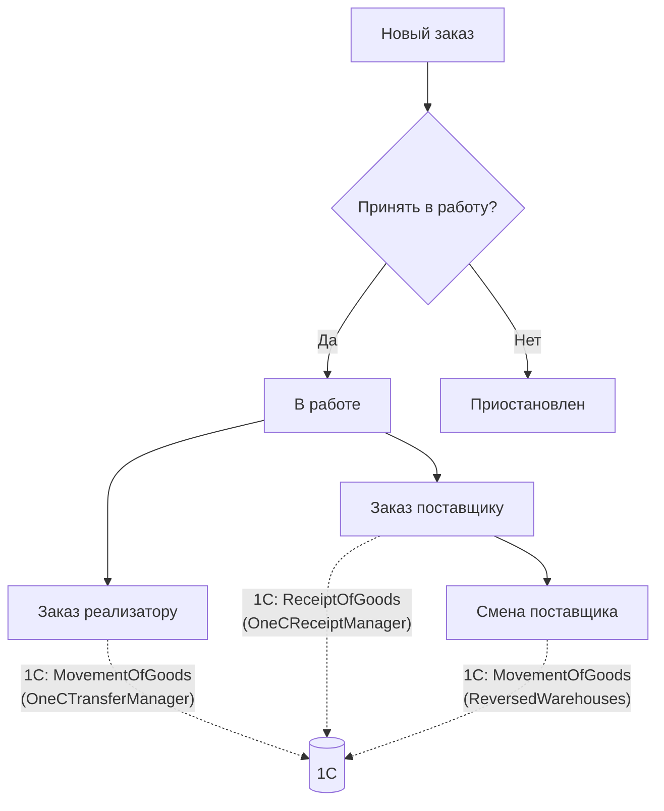
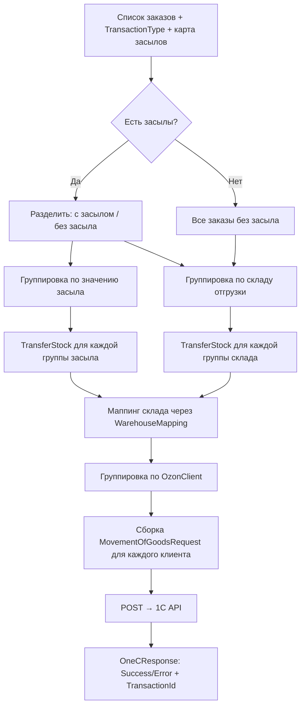
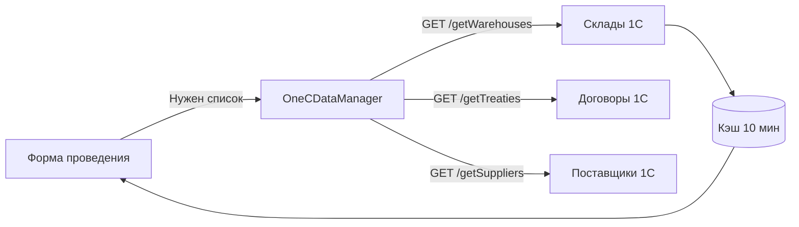

# 🔗 Интеграция с 1С:Предприятие

> Архитектура модуля интеграции SaaS-системы с 1С: понятия, структура кода, API эндпоинты, алгоритмы группировки, модели данных

---

## 📖 Ключевые понятия

### Что такое «Документ» в 1С

**Документ 1С** — это запись о хозяйственной операции в учётной системе. Каждый документ имеет номер, дату, тип и набор реквизитов (полей).

В нашей системе создаются два типа документов:

| Тип документа | Класс запроса | API эндпоинт | Когда создаётся |
|---|---|---|---|
| **Перемещение товаров** | `MovementOfGoodsRequest` | `/movementofgoods/product_json/` | Отгрузка, возврат на склад, перемещение между складами |
| **Поступление товаров** | `ReceiptOfGoodsRequest` | `/receiptofgoods/product_json/` | Приёмка от поставщика (с НДС, договором, номером/датой) |

Документ 1С **не создаётся вручную** — он создаётся автоматически при **проведении транзакции** (смене статуса заказа).

---

### Что такое «Проведение» (Транзакция)

**Проведение** (в коде — `TransactionRecord`) — это бизнес-операция, которая:
1. **Меняет статус заказа** (например: "В работе" → "Заказан")
2. **Применяет изменения к заказу** (заполняет поля: поставщик, дата поставки и т.д.)
3. **Создаёт документ в 1С** (если настроено в конструкторе — поле `OneCDocumentType`)

**Пример:**
Менеджер нажимает "Заказ поставщику" → открывается форма (выбор поставщика, дата, НДС, договор) → менеджер жмёт "Провести" → статус заказа меняется → в 1С создаётся документ "Поступление товаров".

---

### Что такое «Конструктор транзакций»

**Конструктор** — это настраиваемый шаблон (`TransactionDefinition`), который определяет:
- **Из какого статуса** и **в какой статус** переходит заказ (`FromStatusId` → `ToStatusId`)
- **Какие поля** показать менеджеру в форме (`FormSchemaJson`)
- **Как поля формы** маппятся на поля заказа (`FieldMappingJson`)
- **Какой документ 1С** создать при проведении (`OneCDocumentType`)

---

### Жизненный цикл заказа и документы 1С



Каждая пунктирная стрелка — это **документ 1С**, который создаётся автоматически при проведении транзакции.

---

## 1) Структура модуля 1С в проекте

```
AppRepository/ApiServcies/1CApi/
├── OneCApiClient.cs           — HTTP клиент (Basic Auth, POST/GET запросы)
├── OneCApiConfig.cs           — Конфигурация подключения (User, Password)
├── OneCApiUrl.cs              — Константы URL эндпоинтов 1С
├── OneCDataManager.cs         — Получение справочников (склады, договоры, поставщики)
├── OneCTransferManager.cs     — Создание документов "Перемещение товаров"
├── OneCReceiptManager.cs      — Создание документов "Поступление товаров"
├── Models/
│   ├── MovementOfGoodsRequest.cs  — Модель запроса перемещения
│   ├── MovementProduct.cs         — Товар в перемещении (Article + Quantity)
│   ├── ReceiptOfGoodsRequest.cs   — Модель запроса поступления
│   ├── ReceiptProduct.cs          — Товар в поступлении (Article + Quantity + Price + НДС)
│   ├── OneCResponse.cs            — Ответ 1С (Success, Message, TransactionId)
│   ├── WarehouseResponse.cs       — Склад из 1С (Name, Link)
│   ├── TreatyResponse.cs          — Договор из 1С (Link, Name, Partner, Inn)
│   └── SupplierResponse.cs        — Поставщик из 1С (Name, FullName, Inn, Link)
└── DTO/
    └── ShippedBySupplierTransactionDto.cs — Данные для проведения поступления
```

---

## 2) API эндпоинты 1С

1С предоставляет HTTP-сервисы (REST API) по следующим адресам:

```csharp
public class OneCApiUrl
{
    // Создание документов
    public const string MOVEMENT_OF_GOODS_URL = "http://{host}/unf/hs/movementofgoods/product_json/";
    public const string RECEIPT_OF_GOODS_URL  = "http://{host}/unf/hs/receiptofgoods/product_json/";
    
    // Получение справочников
    public const string GET_WAREHOUSES_URL = "http://{host}/unf/hs/getWarehouses";
    public const string GET_TREATIES_URL   = "http://{host}/unf/hs/getTreaties";
    public const string GET_SUPPLIERS_URL  = "http://{host}/unf/hs/getSuppliers";
}
```

| Эндпоинт | Метод | Что делает | Что возвращает |
|---|---|---|---|
| `/movementofgoods/product_json/` | POST | Создаёт документ перемещения | `OneCResponse { Success, Message, TransactionId }` |
| `/receiptofgoods/product_json/` | POST | Создаёт документ поступления | `OneCResponse { Success, Message, TransactionId }` |
| `/getWarehouses` | GET | Список складов | `List<WarehouseResponse> { Name, Link }` |
| `/getTreaties` | GET | Список договоров | `List<TreatyResponse> { Link, Name, Partner, Inn }` |
| `/getSuppliers` | GET | Список поставщиков | `List<SupplierResponse> { Name, FullName, Inn, Link }` |

Авторизация: **Basic Auth** (логин:пароль в Base64).

---

## 3) HTTP клиент — `OneCApiClient`

Наследуется от `BaseApiClient`. Устанавливает Basic Auth заголовок для всех запросов.

```csharp
public class OneCApiClient : BaseApiClient
{
    private readonly string _base64Auth;

    public OneCApiClient(
        IHttpClientFactory? httpClientFactory,
        IEmailService? emailService,
        string username, string password)
        : base(httpClientFactory, emailService, "OneCApi", TimeSpan.FromSeconds(15))
    {
        var authString = $"{username}:{password}";
        _base64Auth = Convert.ToBase64String(Encoding.UTF8.GetBytes(authString));
    }

    protected override void SetHttpClientHeaders(HttpClient client)
    {
        client.DefaultRequestHeaders.Authorization =
            new AuthenticationHeaderValue("Basic", _base64Auth);
    }
}
```

**Ключевые моменты:**
- Таймаут: **15 секунд** (1С может отвечать медленно)
- Используется `IHttpClientFactory` (если доступен через DI)
- Есть метод `GetTestRequest()` для проверки подключения

---

## 4) Модели запросов к 1С

### 4.1 Перемещение товаров (`MovementOfGoodsRequest`)

```csharp
public class MovementOfGoodsRequest
{
    [JsonProperty("Date")]             public string Date { get; set; }              // "14.02.2026 22:00:00"
    [JsonProperty("INNorganization")]  public string INNorganization { get; set; }   // ИНН организации-клиента
    [JsonProperty("WarehouseSender")]  public string WarehouseSender { get; set; }   // Склад-отправитель
    [JsonProperty("SenderRecipient")]  public string SenderRecipient { get; set; }   // Склад-получатель
    [JsonProperty("comment")]          public string Comment { get; set; }           // "Перемещение для клиента X. Заказы: 123, 456"
    [JsonProperty("product")]          public List<MovementProduct> Products { get; set; }
}

public class MovementProduct
{
    [JsonProperty("Article")]   public string Article { get; set; }   // Артикул товара
    [JsonProperty("quantity")]  public int Quantity { get; set; }     // Количество
}
```

### 4.2 Поступление товаров (`ReceiptOfGoodsRequest`)

```csharp
public class ReceiptOfGoodsRequest
{
    [JsonProperty("Date")]             public string Date { get; set; }
    [JsonProperty("INNorganization")]  public string INNorganization { get; set; }   // ИНН организации
    [JsonProperty("Innbuyer")]         public string Innbuyer { get; set; }          // ИНН поставщика
    [JsonProperty("subdivisions")]     public string Subdivisions { get; set; }      // Подразделение
    [JsonProperty("SenderRecipient")]  public string SenderRecipient { get; set; }   // Склад
    [JsonProperty("comment")]          public string Comment { get; set; }
    [JsonProperty("NDS")]              public string NDS { get; set; }               // "да" или ""
    [JsonProperty("contract")]         public string Contract { get; set; }          // Ссылка на договор в 1С
    [JsonProperty("NumberVh")]         public string NumberVh { get; set; }          // Входящий номер
    [JsonProperty("DateVh")]           public string DateVh { get; set; }            // Входящая дата
    [JsonProperty("product")]          public List<ReceiptProduct> Products { get; set; }
}

public class ReceiptProduct
{
    [JsonProperty("Article")]   public string Article { get; set; }
    [JsonProperty("quantity")]  public int Quantity { get; set; }
    [JsonProperty("price")]     public decimal Price { get; set; }      // Закупочная цена
    [JsonProperty("sum")]       public decimal Sum { get; set; }        // Сумма (Price * Quantity)
    [JsonProperty("sumNDS")]    public decimal? SumNDS { get; set; }    // Сумма НДС (20% если применимо)
}
```

### 4.3 Ответ 1С (`OneCResponse`)

```csharp
public class OneCResponse
{
    [JsonProperty("success")]       public bool Success { get; set; }
    [JsonProperty("message")]       public string Message { get; set; }
    [JsonProperty("transactionId")] public string TransactionId { get; set; }  // ID созданного документа в 1С
}
```

---

## 5) Перемещение товаров — `OneCTransferManager`

Это самый сложный класс. Он поддерживает **4 сценария перемещения**:

### 5.1 Схема алгоритма группировки



### 5.2 Четыре сценария перемещения

| Метод | Сценарий | Склад-отправитель | Склад-получатель |
|---|---|---|---|
| `TransferStock()` | Стандартное перемещение | Склад из маппинга (или засыл) | Склад клиента (`client.WarehouseName`) |
| `TransferStockWithReversedWarehouses()` | Возврат на склад (обмен складов) | Склад клиента (`client.WarehouseName`) | Склад из маппинга (или засыл) |
| `TransferStockWithCustomWarehouses()` | Перемещение между произвольными складами | Явно указанный `warehouseSender` | Явно указанный `warehouseRecipient` |
| `TransferStockByWarehouses()` | Оркестратор: разделяет заказы на группы и вызывает `TransferStock()` | — | — |

### 5.3 Что такое «засыл» (orderSupplierMap)

**Засыл** — это когда товар отправляется не со стандартного склада, а с альтернативного (например, напрямую от поставщика). Передаётся как `Dictionary<int, string>` — маппинг `OrderId → имя склада засыла`.

```csharp
// Пример: заказ 101 отправляется со склада "Поставщик Иванов", а не со стандартного
var orderSupplierMap = new Dictionary<int, string>
{
    { 101, "Поставщик Иванов" },
    { 102, "Поставщик Петров" }
};

await transferManager.TransferStockByWarehouses(orders, transactionType, orderSupplierMap);
```

Алгоритм разделения:
1. Заказы **с засылом** — группируются по значению засыла (имя склада поставщика)
2. Заказы **без засыла** — группируются по `ShipmentWarehouse.Name` (склад маркетплейса)

### 5.4 Маппинг складов

Имена складов в маркетплейсе (Ozon, WB) **не совпадают** с именами в 1С. Поэтому используется `WarehouseMappingDataServcies`:

```csharp
// Ozon-имя → 1С-имя
var mappingWarehouse = await _warehouseMappingDataServcies.GetByOzonName("Склад Ozon Хоругвино");
var oneCWarehouseName = mappingWarehouse.BitrixWarehouseName; // "Основной склад"
```

### 5.5 Сборка запроса (пример из кода)

Для каждого клиента (`OzonClient`) строится отдельный `MovementOfGoodsRequest`:

```csharp
foreach (var (client, orders) in ordersByClient)
{
    var products = orders
        .Where(o => !string.IsNullOrEmpty(o.Article) && o.Quantity > 0)
        .Select(o => new MovementProduct
        {
            Article = o.CleanedArticle,
            Quantity = o.TrueQuantity.Value
        }).ToList();

    var model = new MovementOfGoodsRequest
    {
        Date = TimeZoneInfo.ConvertTimeFromUtc(DateTime.UtcNow, tz)
            .ToString("dd.MM.yyyy HH:mm:ss", new CultureInfo("ru-RU")),
        INNorganization = client.INNCode,
        SenderRecipient = client.WarehouseName,
        WarehouseSender = warehouseName,
        Products = products,
        Comment = $"{transactionTypeName} для клиента {client.Name}. " +
                  $"Заказы: {string.Join(", ", orders.Select(o => o.ShipmentNumber))}"
    };
}
```

---

## 6) Поступление товаров — `OneCReceiptManager`

### 6.1 Отличия от перемещения

| Параметр | Перемещение | Поступление |
|---|---|---|
| Товар содержит цену | Нет | Да (`Price`, `Sum`, `SumNDS`) |
| НДС | Нет | Да (20% если `Supplier.IsVatApplicable`) |
| Договор | Нет | Да (`Contract` — ссылка из 1С) |
| Входящий номер/дата | Нет | Да (`NumberVh`, `DateVh`) |
| Поставщик (ИНН) | Нет | Да (`Innbuyer`) |

### 6.2 Входные данные для поступления

Данные приходят из формы проведения транзакции через `ShippedBySupplierTransactionDto`:

```csharp
public class ShippedBySupplierTransactionDto
{
    public string NDS { get; set; }                // "да" / ""
    public string Contract { get; set; }           // Имя договора
    public string NumberVh { get; set; }           // Входящий номер документа
    public DateTime DateVh { get; set; }           // Входящая дата документа
    public string? TransactionComment { get; set; } // Комментарий
    public string? ContractLink { get; set; }      // Ссылка на договор в 1С
}
```

### 6.3 Расчёт НДС в товарах

```csharp
var products = orders.Select(o => new ReceiptProduct
{
    Article = o.CleanedArticle,
    Quantity = o.TrueQuantity.Value,
    Price = o.PurchasePrice ?? 0,
    Sum = (o.PurchasePrice ?? 0) * o.TrueQuantity.Value,
    SumNDS = (o.PurchasePrice ?? 0) * o.TrueQuantity.Value
             * (o.Supplier.IsVatApplicable ? 0.20m : null)  // 20% НДС или null
}).ToList();
```

### 6.4 Валидации перед отправкой

`OneCReceiptManager` проверяет:
- Все заказы должны иметь **один склад отгрузки** (нельзя смешивать)
- Все заказы должны иметь **одного поставщика** (по ИНН)
- Должна быть указана **ссылка на договор** (`ContractLink`)
- Маппинг склада должен существовать в `WarehouseMappingDataServcies`
- У каждого клиента должен быть **ИНН и склад**

---

## 7) Справочники 1С — `OneCDataManager`

Получает справочные данные из 1С для отображения в формах:



### Кэширование складов

```csharp
private static DateTime _cacheTimestamp;
private static readonly TimeSpan _cacheLifetime = TimeSpan.FromMinutes(10);
private static List<WarehouseResponse>? _cachedWarehouses;

public async Task<List<WarehouseResponse>> GetWarehouseListAsync()
{
    if (_cachedWarehouses != null && DateTime.UtcNow - _cacheTimestamp < _cacheLifetime)
        return _cachedWarehouses;

    var response = await _apiClient.MakeRequestGetAsync(OneCApiUrl.GET_WAREHOUSES_URL);
    _cachedWarehouses = JsonConvert.DeserializeObject<List<WarehouseResponse>>(response);
    _cacheTimestamp = DateTime.UtcNow;
    return _cachedWarehouses;
}
```

> ⚠️ **Проблема в SaaS:** Кэш сделан через `static` — данные **перемешаются между тенантами**. В SaaS нужно использовать ключ `tenant:{tenantId}:1c:warehouses` и хранить в Redis.

---

## 8) Полная схема потока данных

```
┌──────────────────────────────────────────────────────────────────────────┐
│  МЕНЕДЖЕР нажимает "Провести" в UI                                      │
└──────────────────────┬───────────────────────────────────────────────────┘
                       ▼
┌──────────────────────────────────────────────────────────────────────────┐
│  TransactionService.ExecuteTransactionAsync()                            │
│  1. Проверяет статус заказа (FromStatusId == Order.StatusId)             │
│  2. Применяет маппинг полей (FieldMappingJson → Order)                  │
│  3. Меняет статус заказа (Order.StatusId = ToStatusId)                  │
│  4. Создаёт TransactionRecord (InputDataJson, OneCStatus = Pending)     │
│  5. SaveChangesAsync()                                                   │
│  6. Hangfire.Enqueue → OneCJob.SendTransactionTo1C(recordId, docType)   │
└──────────────────────┬───────────────────────────────────────────────────┘
                       ▼
┌──────────────────────────────────────────────────────────────────────────┐
│  Hangfire Job (фоновая задача)                                           │
│                                                                          │
│  Если docType == "Movement":                                             │
│    OneCTransferManager.TransferStockByWarehouses(orders, type, zasylMap) │
│    → Разделяет заказы: с засылом / без засыла                           │
│    → Группирует по складу или засылу                                     │
│    → Для каждой группы: маппинг склада → группировка по клиенту         │
│    → Сборка MovementOfGoodsRequest для каждого клиента                  │
│    → POST /movementofgoods/product_json/                                │
│                                                                          │
│  Если docType == "Receipt":                                              │
│    OneCReceiptManager.CreateReceipts(orders, dto)                        │
│    → Проверка: один склад, один поставщик, есть договор                 │
│    → Маппинг склада                                                      │
│    → Группировка по клиенту                                              │
│    → Сборка ReceiptOfGoodsRequest (с ценами, НДС, договором)            │
│    → POST /receiptofgoods/product_json/                                 │
│                                                                          │
│  Результат: OneCResponse { Success, Message, TransactionId }            │
│  → Обновляем TransactionRecord.OneCStatus / OneCId / OneCError          │
└──────────────────────────────────────────────────────────────────────────┘
```

---

## 9) Требования к SaaS-версии (что нужно доработать)

### 9.1 Изоляция по tenant

В текущем коде `OneCApiConfig` содержит один логин/пароль. В SaaS у каждого клиента свои:

```csharp
// SaaS-версия настроек
public class OneCSettings
{
    public Guid Id { get; set; }
    public Guid TenantId { get; set; }
    public string BaseUrl { get; set; } = default!;
    public string Username { get; set; } = default!;
    public string Password { get; set; } = default!;
    public string OrganizationInn { get; set; } = default!;
    public bool IsEnabled { get; set; }
}
```

### 9.2 Идемпотентность (обязательно для Hangfire)

Правило: на каждый `TransactionId` может быть **только один успешный документ 1С** данного типа.

```csharp
var alreadySent = await _db.OneCDocuments
    .AnyAsync(x => x.TransactionId == transactionId
                && x.DocumentType == "Movement"
                && x.Status == "Success", ct);
if (alreadySent) return;
```

### 9.3 Реестр отправок (для аудита и повторов)

```csharp
public class OneCDocument
{
    public Guid Id { get; set; }
    public Guid TenantId { get; set; }
    public string DocumentType { get; set; } = default!;    // Movement, Receipt
    public Guid TransactionId { get; set; }                 // связь с TransactionRecord
    public string? OneCExternalId { get; set; }             // TransactionId из OneCResponse
    public string Status { get; set; } = "Pending";         // Pending/Success/Failed
    public int Attempts { get; set; }
    public string? LastError { get; set; }
    public DateTime CreatedAt { get; set; }
    public DateTime? SentAt { get; set; }
}
```

### 9.4 Кэширование справочников

Заменить `static` кэш на tenant-изолированный:
- Ключ: `tenant:{tenantId}:1c:warehouses`
- TTL: 10–60 минут
- Хранилище: Redis (если несколько инстансов приложения)

### 9.5 Outbox-паттерн

Не вызывать 1С напрямую из UI. Сохранять задачу в БД, обрабатывать через Hangfire:

```csharp
public class OneCExportTask
{
    public Guid Id { get; set; }
    public Guid TenantId { get; set; }
    public Guid TransactionId { get; set; }
    public string DocumentType { get; set; } = default!;
    public string PayloadJson { get; set; } = default!;
    public string Status { get; set; } = "New";
    public DateTime CreatedAt { get; set; }
}
```

### 9.6 Откат при ошибке

- **Запись в свою БД** — в транзакции EF Core
- **Вызов 1С** не откатить (внешний мир). Поэтому:
  1. Отправили запрос в 1С
  2. Получили `TransactionId` (ID документа)
  3. Только после этого коммитим "успех" в БД
  4. Если упали — фиксируем `Failed` с ошибкой, даём ретрай

---

## 🔗 Связанные разделы

- [**Конструктор транзакций (проведений)**](./транзакции.md) - мета-модель, журнал проведений, динамические формы, Pipeline
- [**Hangfire в Multi-Tenant**](./SaaS+Hangfire.md) - настройка фоновых задач с TenantId
- [**HTTP клиенты**](./http.md) - IHttpClientFactory, DelegatingHandler, ретраи
- [**Кэширование**](./Кэширование%20—%20мощнейший%20инструмент%20в%20SaaS.md) - стратегии кэширования с tenant-изоляцией
- [**Важно**](./Важно.md) - критичные ошибки и чек-лист перед деплоем